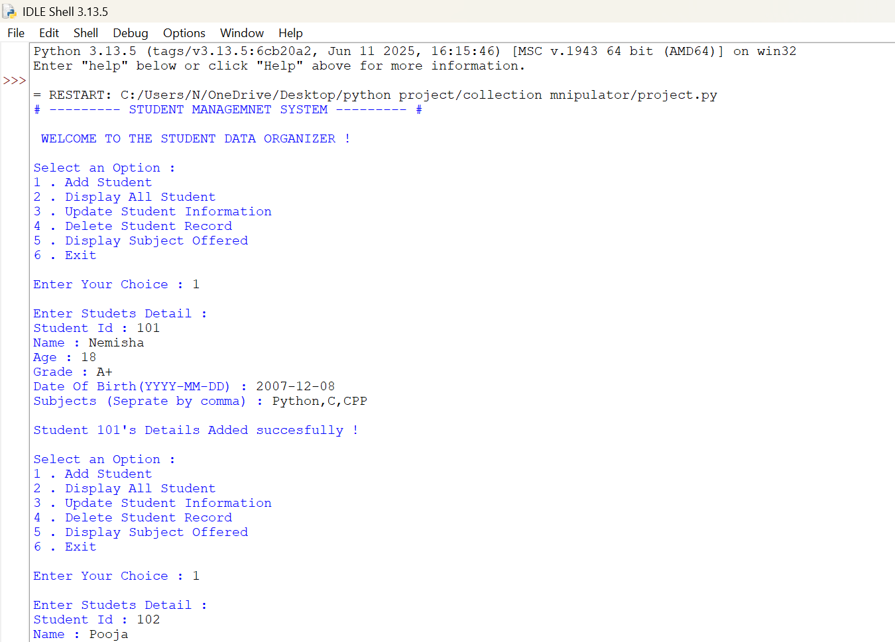
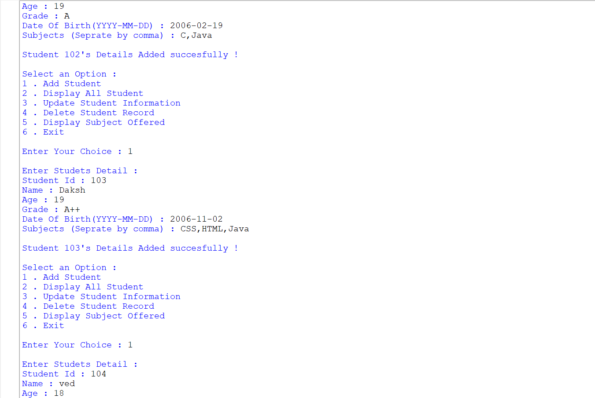
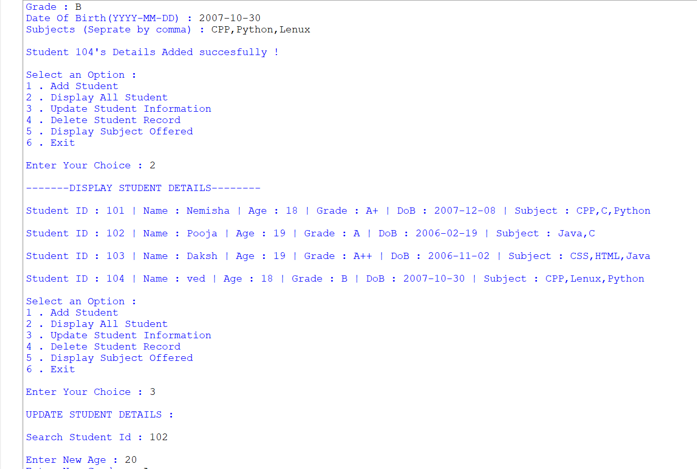
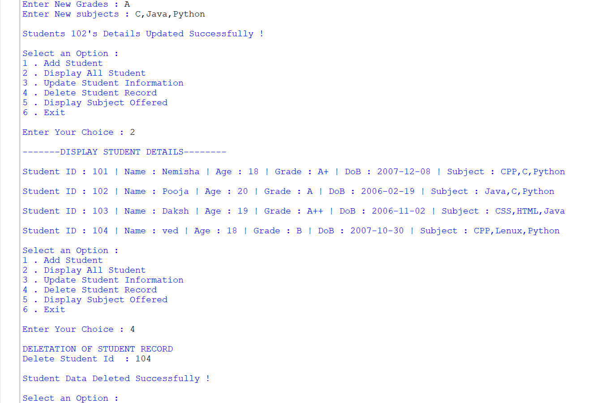
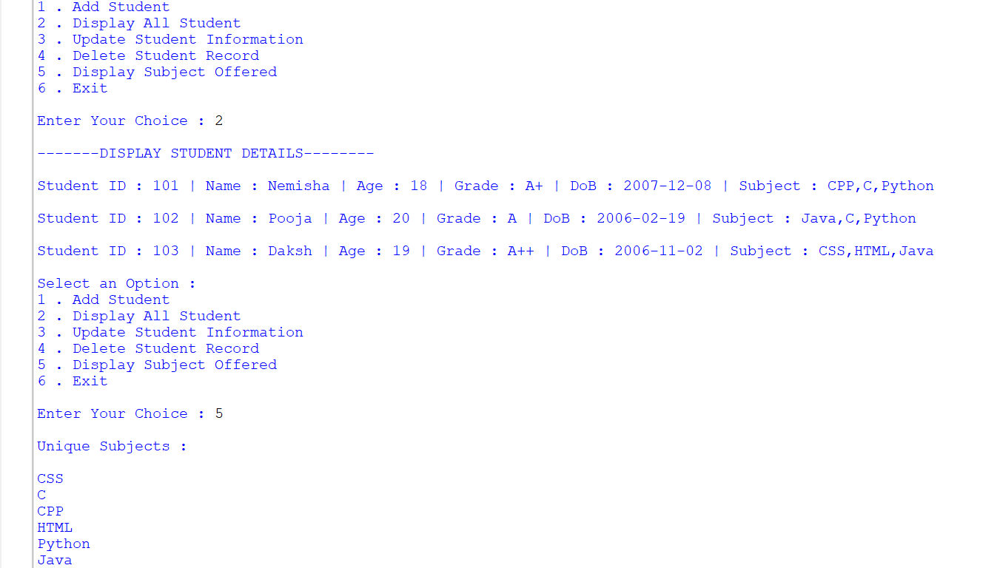
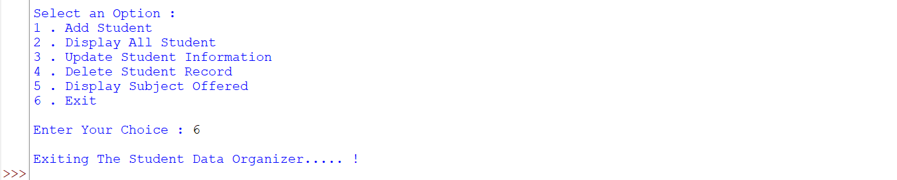

# Student Data Organizer

A simple yet effective **Python-based Student Data Organizer** developed to manage student records in a structured and user-friendly way. This project is designed using core Python concepts and demonstrates the practical use of data structures such as lists, dictionaries, tuples, and sets.

---

## Project Overview

The **Student Data Organizer** is a console-based application that allows users to store, view, update, and delete student information efficiently. It is a menu-driven program that helps organize student details in a systematic manner.

This project is especially useful for understanding how Python can be used to build small real-world management systems.

---

## Features

* Add new student records
* Display all stored student details
* Update existing student information
* Delete student records
* Display unique subjects using sets
* Menu-driven interface for easy navigation
* Simple and interactive console output
* Basic input handling and validation

---

## Technologies Used

* Python 3
* Lists
* Dictionaries
* Tuples
* Sets
* Conditional Statements
* Loops
* Match-case statements

---

## Data Structures Used

| Data Structure | Purpose                                               |
| -------------- | ----------------------------------------------------- |
| List           | Stores all student records                            |
| Dictionary     | Stores individual student details                     |
| Tuple          | Stores fixed values like Student ID and Date of Birth |
| Set            | Stores unique subjects without duplication            |

---

## How the Project Works

1. The user runs the Python program.
2. A menu is displayed with different options.
3. The user can choose to add, view, update, or delete student records.
4. Student data is stored and managed using Python data structures.
5. The program continues until the user chooses to exit.

---

## Project Objectives

* To understand the use of Python data structures in a practical application
* To build a simple student record management system
* To improve logical thinking and problem-solving skills
* To create a clean and interactive menu-based program

---

## Screenshots

### Outputs

---

## Video Demonstration

Video Link :

[Click here to watch the project demo](https://1drv.ms/v/c/b34701bd9fbf5b2c/IQDkg3dkit1xQIVdryG_Q_EWAYJVnswQXZE80QuV05O6b7M?e=i5OFOf)

---

## How to Run the Project

1. Install Python 3 on your system.
2. Download or clone the project files.
3. Open the terminal or command prompt.
4. Run the Python file using the command:

bash
python project.py

5. Follow the on-screen menu options.

---

## Learning Outcome

By completing this project, I learned:

* How to use Python data structures effectively
* How to build a menu-driven application
* How to manage student records in a structured format
* How to organize code for better readability and usability

---

## Conclusion

The **Student Data Organizer** is a useful beginner-level Python project that demonstrates the power of core programming concepts in a practical way. It is simple, efficient, and suitable for academic submission as well as learning purposes.

---

## Developed By

Nemisha Dave
AI / ML - Data science
